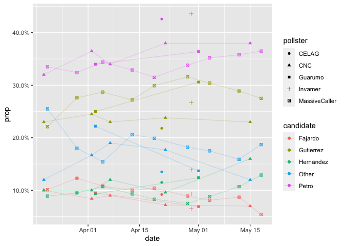

# Read and tidy data

```r
library(readr)
library(dplyr)
library(tidyr)

start_date <- as.Date("2022-03-13")
candidates <- c(
    "Petro",
    "Gutierrez",
    "Hernandez",
    "Fajardo"
)

prefix <- "https://raw.githubusercontent.com/nelsonamayad/Elecciones-presidenciales-2022/main/"
path <- "Encuestas%202022/encuestas_2022.csv"

df <- paste0(prefix, path) %>%
    readr::read_csv(
        col_types = list(
            encuestadora = col_character(),
            fuente = col_character(),
            link = col_character(),
            muestreo = col_character(),
            tipo = col_character(),
            hipotesis = col_character(),
            fecha = col_date(),
            n = col_integer(),
            .default = col_double()
        )
    ) %>%
    select(
        -n,
        -tasa_respuesta,
        -fuente,
        -hipotesis,
        -muestra_int_voto,
        -margen_error
    ) %>%
    rename(
        pollster = encuestadora,
        date= fecha,
        sample_size = muestra,
        other = otros,
        other_nsnr=ns_nr,
        sample_type = muestreo,
        poll_mode = tipo,
        num_cities = municipios
    ) %>%
    filter(date > start_date) %>%
    tidyr::pivot_longer(
        !c(
            pollster,
            date,
            sample_size,
            link,
            sample_type,
            poll_mode,
            num_cities   
        ),
        names_to = "candidate",
        values_to = "prop"
    ) %>%
    mutate(
        candidate = stringr::str_to_title(
            stringr::str_extract(
                candidate, "[^_]+$"
            )
        ),
        candidate = ifelse(
            candidate %in% candidates,
            candidate,
            "Other"
        ),
        prop = prop / 100
    ) %>%
    group_by(
        pollster,
        date,
        candidate,
        sample_size,
        link,
        sample_type,
        poll_mode,
        num_cities
    ) %>%
    summarise(
        prop=sum(prop, na.rm=TRUE),
        .groups="drop"
    ) %>%
    mutate(
        vote = round(prop * sample_size)
    ) %>%
    relocate(
        poll_mode,
        candidate,
        vote,
        prop,
        .after = date
    ) %>%
    arrange(
        date, pollster, candidate
    )

knitr::kable(head(select(df, -link), 20))
```


|pollster      |date       |poll_mode               |candidate | vote|  prop| sample_size|sample_type              | num_cities|
|:-------------|:----------|:-----------------------|:---------|----:|-----:|-----------:|:------------------------|----------:|
|CNC           |2022-03-20 |telefonico y presencial |Fajardo   |  214| 0.100|        2143|Estratificado municipios |         43|
|CNC           |2022-03-20 |telefonico y presencial |Gutierrez |  493| 0.230|        2143|Estratificado municipios |         43|
|CNC           |2022-03-20 |telefonico y presencial |Hernandez |  214| 0.100|        2143|Estratificado municipios |         43|
|CNC           |2022-03-20 |telefonico y presencial |Other     |  257| 0.120|        2143|Estratificado municipios |         43|
|CNC           |2022-03-20 |telefonico y presencial |Petro     |  686| 0.320|        2143|Estratificado municipios |         43|
|MassiveCaller |2022-03-21 |telefonica              |Fajardo   |  101| 0.101|        1000|NA                       |         NA|
|MassiveCaller |2022-03-21 |telefonica              |Gutierrez |  221| 0.221|        1000|NA                       |         NA|
|MassiveCaller |2022-03-21 |telefonica              |Hernandez |   89| 0.089|        1000|NA                       |         NA|
|MassiveCaller |2022-03-21 |telefonica              |Other     |  255| 0.255|        1000|NA                       |         NA|
|MassiveCaller |2022-03-21 |telefonica              |Petro     |  335| 0.335|        1000|NA                       |         NA|
|YanHaas       |2022-03-21 |presencial              |Fajardo   |  124| 0.100|        1236|Estratificado municipios |         60|
|YanHaas       |2022-03-21 |presencial              |Gutierrez |  235| 0.190|        1236|Estratificado municipios |         60|
|YanHaas       |2022-03-21 |presencial              |Hernandez |  136| 0.110|        1236|Estratificado municipios |         60|
|YanHaas       |2022-03-21 |presencial              |Other     |  290| 0.235|        1236|Estratificado municipios |         60|
|YanHaas       |2022-03-21 |presencial              |Petro     |  457| 0.370|        1236|Estratificado municipios |         60|
|MassiveCaller |2022-03-29 |telefonica              |Fajardo   |  123| 0.123|        1000|NA                       |         NA|
|MassiveCaller |2022-03-29 |telefonica              |Gutierrez |  276| 0.276|        1000|NA                       |         NA|
|MassiveCaller |2022-03-29 |telefonica              |Hernandez |   95| 0.095|        1000|NA                       |         NA|
|MassiveCaller |2022-03-29 |telefonica              |Other     |  180| 0.180|        1000|NA                       |         NA|
|MassiveCaller |2022-03-29 |telefonica              |Petro     |  324| 0.324|        1000|NA                       |         NA|


# Visualize raw data

```r
library(ggplot2)
library(scales)

pollsters <- c(
    "CNC",
    "CELAG",
    "Guarumo",
    "Invamer",
    "MassiveCaller",
    "YanHass"
)

df %>%
    filter(pollster %in% pollsters) %>%
    ggplot(aes(date, prop, color=candidate, shape=pollster)) +
    geom_point(alpha=1) +
    geom_line(alpha=0.2) +
    scale_y_continuous(labels = scales::percent)
```

<!-- -->
